<!--
 * @Author: benjie
 * @Date: 2024-07-21 23:19:51
 * @LastEditTime: 2024-07-22 11:58:37
 * @LastEditors: benjie
 * @Description: 
-->
# 1. create project
> npx create-react-app my-app
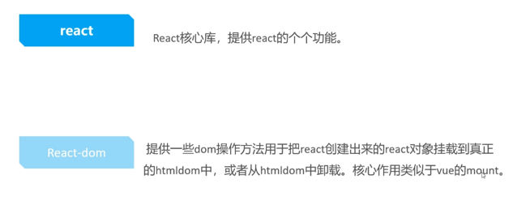

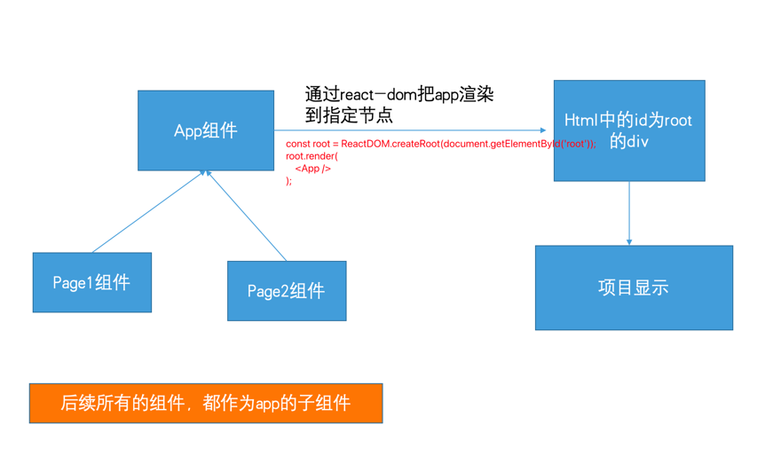
react-demo用来把react组件渲染成dom/卸载dom
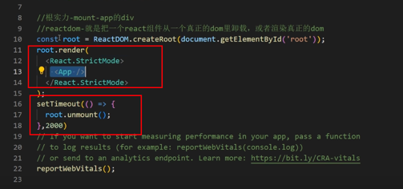
# 2. jsx和react
jsx和react可以混用；
jsx创建组件快；
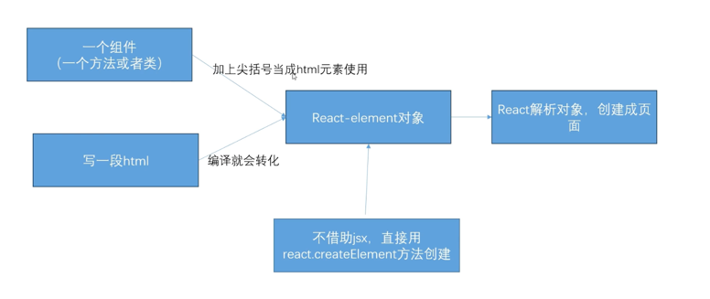

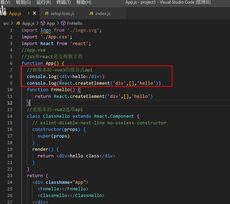

方法名加了尖括号就会被渲染成react-element对象，react解析该对象渲染成页面；
```js
console.log(<div>hello</div>);
console.log(React.createElement('div', [], 'hello'));
```

- **`<h1 className="foo">Hello, world</h1>`**：定义了一个包含文本 "Hello, world" 的 `<h1>` 元素，并将 `className` 设置为 `"foo"`。
- **`ReactDOM.createRoot(document.getElementById("root"))`**：创建一个 React 根节点实例，将其挂载到 id 为 `"root"` 的 DOM 元素上。
- **`root.render(element)`**：将 JSX 元素 `element` 渲染到指定的 DOM 节点中，使得页面上 id 为 `"root"` 的位置显示出定义的 `<h1>` 元素。

这是 React 中将组件渲染到页面的基本方法。

### JSX 的基本概念

**JSX (JavaScript XML)** 是一种 JavaScript 语法扩展，用于描述 React 组件的外观。它看起来很像 HTML，但实际上是 JavaScript 语法。JSX 允许你在 JavaScript 中编写类似 HTML 的代码，这样可以更加直观地构建用户界面。

### JSX 的特点

1. **JavaScript 表达式**：
   在 JSX 中，可以嵌入 JavaScript 表达式。任何被花括号 `{}` 包围的内容都可以是 JavaScript 表达式。例如：

   ```jsx
   const name = 'Alice';
   const greeting = <h1>Hello, {name}!</h1>;
   ```

2. **属性**：
   JSX 使用 `className` 来设置 CSS 类，而不是 `class`。这是因为 `class` 是 JavaScript 的保留字。例如：

   ```jsx
   const element = <div className="container">Hello World</div>;
   ```

3. **条件渲染**：
   可以在 JSX 中使用 JavaScript 条件运算符来决定是否渲染某些内容。例如：

   ```jsx
   const isLoggedIn = true;
   const greeting = (
     <div>
       {isLoggedIn ? <p>Welcome back!</p> : <p>Please sign up.</p>}
     </div>
   );
   ```

4. **列表渲染**：
   使用 `map` 方法来渲染列表中的项。例如：

   ```jsx
   const items = ['Apple', 'Banana', 'Cherry'];
   const list = (
     <ul>
       {items.map((item, index) => <li key={index}>{item}</li>)}
     </ul>
   );
   ```

5. **嵌套元素**：
   JSX 允许将多个元素嵌套在一起。一个 JSX 表达式必须有一个父级元素。例如：div是父级；

   ```jsx
   const element = (
     <div>
       <h1>Hello World</h1>
       <p>This is a paragraph.</p>
     </div>
   );
   ```

6. **表达式和语法**：
   JSX 可以包含任何有效的 JavaScript 表达式，包括函数调用、变量、算术运算等。例如：

   ```jsx
   const sum = 1 + 2;
   const element = <h1>The sum is {sum}</h1>;
   ```

7. **函数组件**：
   JSX 通常用在 React 组件中。函数组件可以返回 JSX 元素来描述 UI。例如：

   ```jsx
   function Welcome(props) {
     return <h1>Hello, {props.name}</h1>;
   }
   ```

# 3. 事件绑定
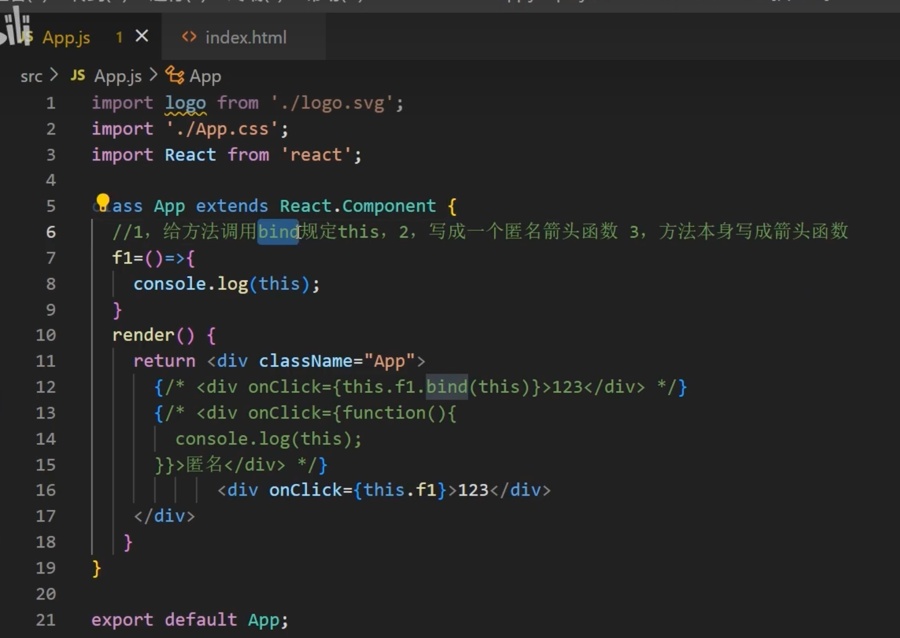
onClick = {匿名箭头函数}，也可以把箭头函数写到外面；
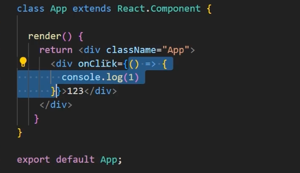

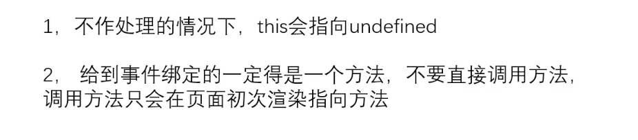

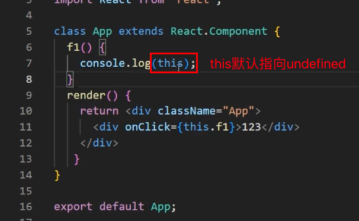

采用this.f1.bind(this)来绑定this指向App组件；

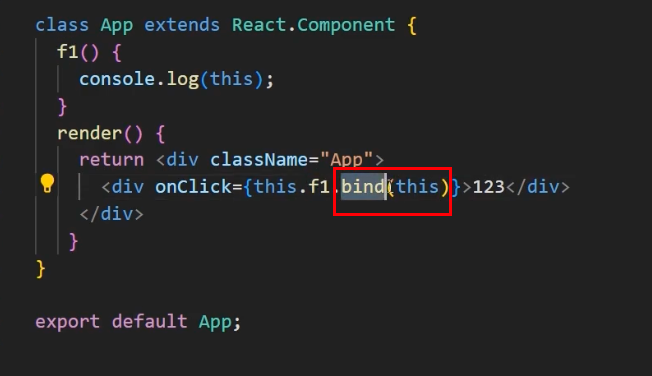
匿名箭头函数默认让this指向了App组件；
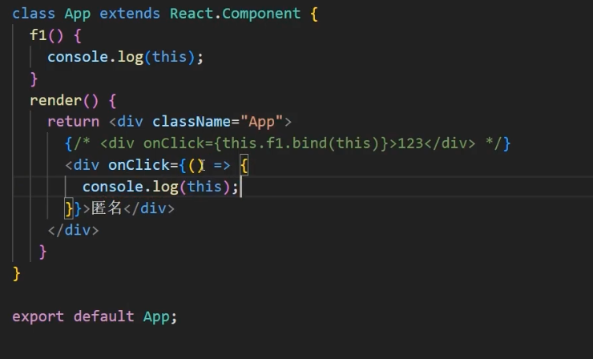

方法写到外面，必须写成箭头函数，这样也会让this指向App；
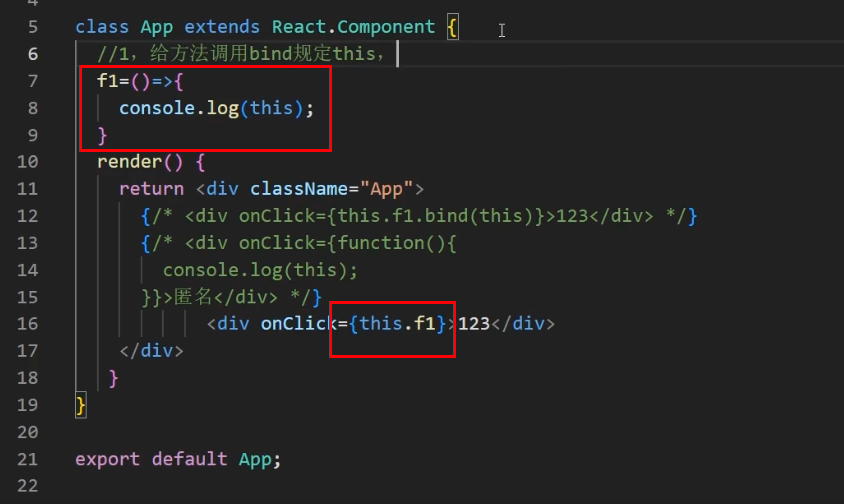

如果要使用this.f1()去调用函数，f1必须得有返回值，否则onClick绑定的是undefined，也就是点击123没有反应；

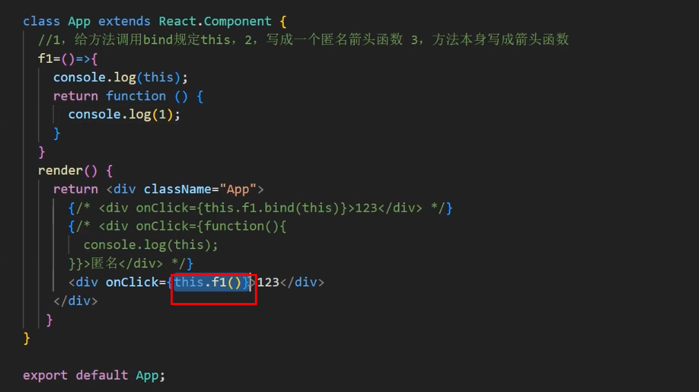


通过bind传递参数；
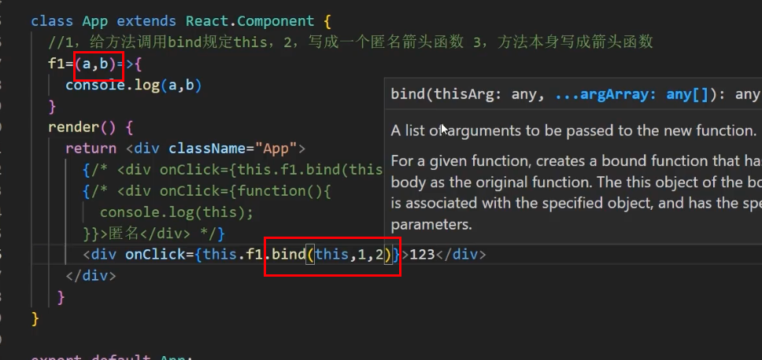

没传参数，事件对象（合成的事件对象，包含原生事件对象）就是第一个参数；传了参数，事件对象是最后一个参数；
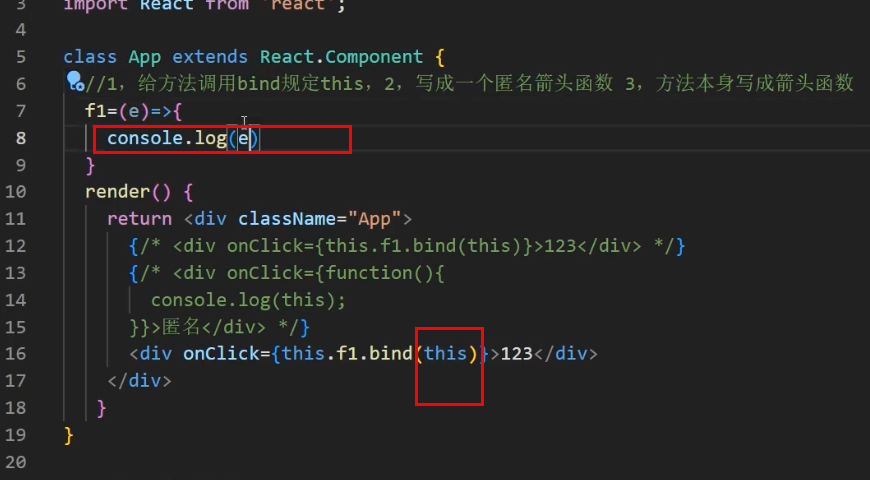

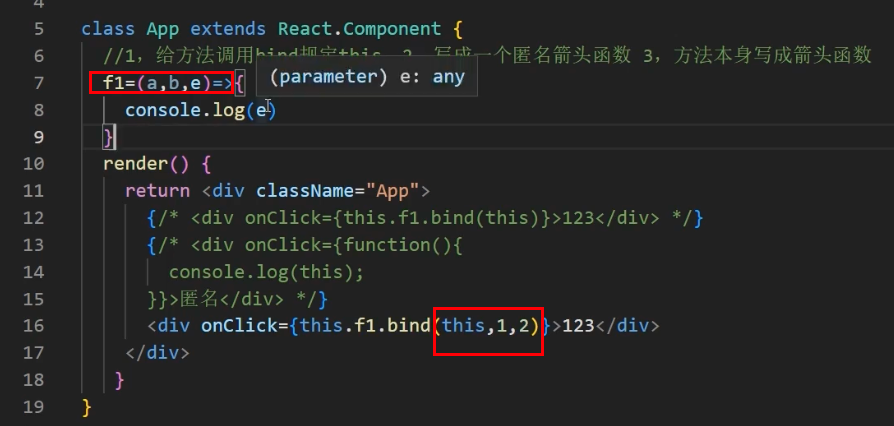

阻止默认行为，冒泡；
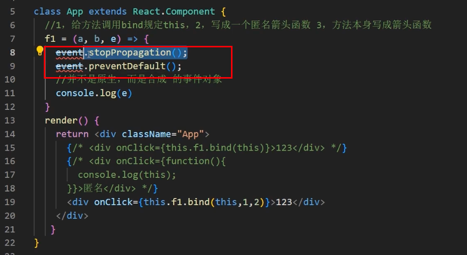

在React中，阻止默认行为和冒泡行为通常通过事件对象的相关方法来实现。以下是一些示例，展示如何在React中实现这些操作：

### 1. 阻止默认行为
阻止默认行为意味着防止浏览器执行事件的默认动作。例如，在表单提交时，阻止表单的默认提交行为。

```jsx
import React from 'react';

class MyForm extends React.Component {
  handleSubmit = (event) => {
    event.preventDefault(); // 阻止表单的默认提交行为
    alert('Form submission prevented!');
  };

  render() {
    return (
      <form onSubmit={this.handleSubmit}>
        <label>
          Name:
          <input type="text" name="name" />
        </label>
        <button type="submit">Submit</button>
      </form>
    );
  }
}

export default MyForm;
```

在这个示例中，当用户点击提交按钮时，`handleSubmit` 方法会阻止表单的默认提交行为，并显示一个警告框。

### 2. 阻止冒泡行为
冒泡行为是指事件从目标元素冒泡到祖先元素。在某些情况下，我们可能希望阻止这种行为。例如，在一个嵌套的按钮点击事件中，我们希望阻止内层按钮的点击事件冒泡到外层。

```jsx
import React from 'react';

class NestedButtons extends React.Component {
  handleOuterClick = () => {
    alert('Outer button clicked!');
  };

  handleInnerClick = (event) => {
    event.stopPropagation(); // 阻止事件冒泡
    alert('Inner button clicked!');
  };

  render() {
    return (
      <div>
        <button onClick={this.handleOuterClick}>
          Outer Button
          <button onClick={this.handleInnerClick} style={{ marginLeft: 20 }}>
            Inner Button
          </button>
        </button>
      </div>
    );
  }
}

export default NestedButtons;
```

在这个示例中，当用户点击内层按钮时，`handleInnerClick` 方法会阻止事件冒泡，因此外层按钮的点击事件处理程序不会被触发。

### 总结
- **阻止默认行为**：使用 `event.preventDefault()` 方法。
- **阻止冒泡行为**：使用 `event.stopPropagation()` 方法。

通过这两个方法，我们可以在React应用中更灵活地控制事件处理流程。

# 4. 响应式数据

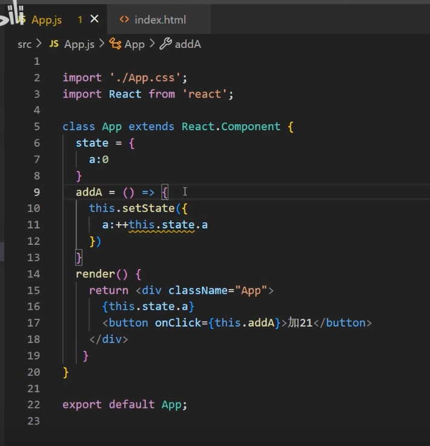

setState作用：1. 修改数据；2，触发页面刷新；
流程：
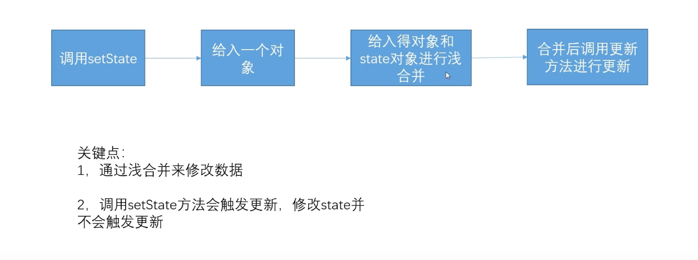

修改时注意；这样c1会顶掉c2；c2不见了；

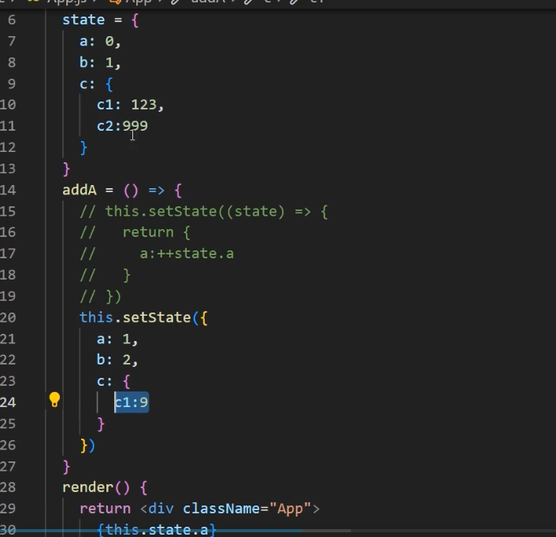

## 更新数据
在React中，当状态（state）是一个对象时，直接使用 `setState` 更新对象的一部分属性而不包含其他未修改的属性会导致这些未修改的属性丢失。这是因为 `setState` 并不会自动合并嵌套对象。我们需要手动合并对象，确保未修改的属性保留。

以下是一个示例，展示了如果不正确更新对象状态会导致数据丢失，以及正确的更新方法：

### 不正确的更新方法

```jsx
import React, { useState } from 'react';

function UserProfile() {
  const [user, setUser] = useState({
    name: 'John Doe',
    age: 30,
    address: {
      city: 'New York',
      country: 'USA'
    }
  });

  const updateCity = () => {
    // 直接使用 setState 仅更新 address 的 city 属性
    setUser({
      ...user,
      address: {
        city: 'Los Angeles'
      }
    });
  };

  return (
    <div>
      <p>Name: {user.name}</p>
      <p>Age: {user.age}</p>
      <p>City: {user.address.city}</p>
      <p>Country: {user.address.country}</p>
      <button onClick={updateCity}>Update City</button>
    </div>
  );
}

export default UserProfile;
```

在上述示例中，点击 "Update City" 按钮后，`user.address` 对象中的 `country` 属性会丢失，因为 `setUser` 仅设置了 `address` 的 `city` 属性，而没有包括 `country` 属性。

### 正确的更新方法

为了正确更新状态并保留未修改的属性，我们需要手动合并嵌套对象：

```jsx
import React, { useState } from 'react';

function UserProfile() {
  const [user, setUser] = useState({
    name: 'John Doe',
    age: 30,
    address: {
      city: 'New York',
      country: 'USA'
    }
  });

  const updateCity = () => {
    // 手动合并 address 对象，保留未修改的属性
    setUser({
      ...user,
      address: {
        ...user.address,
        city: 'Los Angeles'
      }
    });
  };

  return (
    <div>
      <p>Name: {user.name}</p>
      <p>Age: {user.age}</p>
      <p>City: {user.address.city}</p>
      <p>Country: {user.address.country}</p>
      <button onClick={updateCity}>Update City</button>
    </div>
  );
}

export default UserProfile;
```

在这个示例中，我们使用了展开运算符 `...` 来合并 `user.address` 对象。这确保了 `address` 对象的 `country` 属性不会丢失。

### 总结
- 直接更新对象的一部分属性会导致未包含的属性丢失。
- 使用展开运算符合并对象，以确保未修改的属性保留。

## setState是异步的
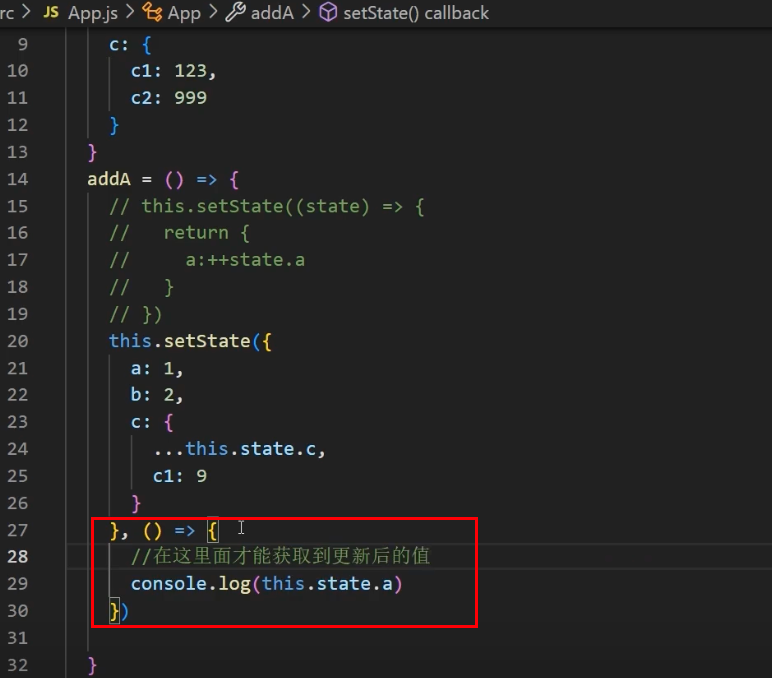
`setState` 是 React 中用于更新组件状态的方法，它通常是异步的。异步的 `setState` 意味着状态更新不会立即反映在组件中，而是会在稍后的时间内批量处理，优化性能。

下面是几个示例，展示了 `setState` 的异步特性和如何处理这种异步行为。

### 示例1：`setState` 的异步性

```jsx
import React, { useState } from 'react';

function Counter() {
  const [count, setCount] = useState(0);

  const increment = () => {
    console.log('Before setState:', count);
    setCount(count + 1);
    console.log('After setState:', count); // 这里的 count 仍然是旧值
  };

  return (
    <div>
      <p>Count: {count}</p>
      <button onClick={increment}>Increment</button>
    </div>
  );
}

export default Counter;
```

在这个示例中，点击按钮时，`setCount` 会更新状态，但由于它是异步的，`console.log` 输出的 `count` 值不会立即反映状态的变化。输出结果可能是：

```
Before setState: 0
After setState: 0
```

### 示例2：处理 `setState` 的异步性

如果需要在状态更新之后立即获取更新后的值，可以使用 `useEffect` 或者将更新逻辑放在 `setState` 的回调函数中。

#### 方法1：使用 `useEffect`

```jsx
import React, { useState, useEffect } from 'react';

function Counter() {
  const [count, setCount] = useState(0);

  useEffect(() => {
    console.log('Count updated:', count);
  }, [count]);

  const increment = () => {
    setCount(count + 1);
  };

  return (
    <div>
      <p>Count: {count}</p>
      <button onClick={increment}>Increment</button>
    </div>
  );
}

export default Counter;
```

在这个示例中，每当 `count` 更新时，`useEffect` 中的回调函数会被调用，输出更新后的 `count` 值。

#### 方法2：使用 `setState` 的回调函数

在函数组件中，`useState` 没有提供回调选项，但是我们可以使用多个 `setState` 调用来实现类似的效果。在类组件中，可以直接使用 `setState` 的回调函数。

```jsx
import React from 'react';

class Counter extends React.Component {
  constructor(props) {
    super(props);
    this.state = { count: 0 };
  }

  increment = () => {
    this.setState(
      (prevState) => ({ count: prevState.count + 1 }),
      () => {
        console.log('Count updated:', this.state.count);
      }
    );
  };

  render() {
    return (
      <div>
        <p>Count: {this.state.count}</p>
        <button onClick={this.increment}>Increment</button>
      </div>
    );
  }
}

export default Counter;
```

在这个示例中，`setState` 的第二个参数是一个回调函数，会在状态更新后立即执行，确保 `this.state.count` 是最新的值。

### 总结

- `setState` 是异步的，意味着状态更新不会立即反映在组件中。
- 为了在状态更新后执行某些操作，可以使用 `useEffect`（对于函数组件）或 `setState` 的回调函数（对于类组件）。

## 注意：
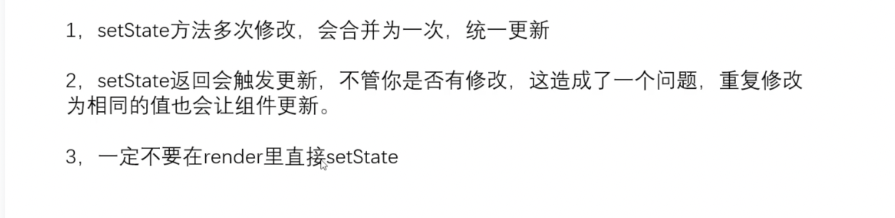
1. 死循环问题，render中调用setState，因为setState会调用render触发页面渲染，render继续setState，，，循环；
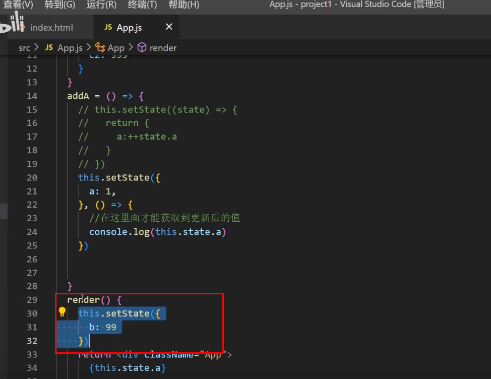

2. 批处理

在React中，如果你在一个事件处理函数中多次调用`setState`，React会将这些调用合并为一次更新，以提高性能。这种行为称为批处理（batching）。

以下是一个示例，展示了多次调用`setState`如何触发一次更新：

### 示例：多次调用`setState`触发一次更新

```jsx
import React, { useState } from 'react';

function BatchUpdate() {
  const [state, setState] = useState({ count1: 0, count2: 0 });

  const handleClick = () => {
    setState((prevState) => ({ ...prevState, count1: prevState.count1 + 1 }));
    setState((prevState) => ({ ...prevState, count2: prevState.count2 + 1 }));
    console.log('State after setState calls:', state);
  };

  return (
    <div>
      <p>Count1: {state.count1}</p>
      <p>Count2: {state.count2}</p>
      <button onClick={handleClick}>Increment Counts</button>
    </div>
  );
}

export default BatchUpdate;
```

在这个示例中，当用户点击按钮时，`handleClick` 函数会依次调用两次`setState`。由于React的批处理机制，这两个状态更新会合并为一次更新。

### 批处理的效果

点击按钮后的控制台输出可能是：

```
State after setState calls: { count1: 0, count2: 0 }
```

在`setState`调用后的`console.log`仍然会显示旧的状态值，这是因为`setState`是异步的，且React会在事件处理函数执行完成后才进行一次批量更新。

### 更新后的渲染结果

页面上的`Count1`和`Count2`都会同时更新，且仅触发一次重新渲染：

```
Count1: 1
Count2: 1
```

### 总结

- 在同一个事件处理函数中多次调用`setState`时，React会将这些调用合并为一次更新，以提高性能。
- 在事件处理函数内调用`setState`是异步的，状态更新会在函数执行完成后进行批量处理。

在类组件中，`setState` 的使用方式稍有不同，但整体概念与函数组件中的 `useState` 类似。你可以通过传递一个函数来更新状态，该函数接收 `prevState` 并返回一个新的状态对象。以下是一个详细的示例，展示了在类组件中使用 `setState` 进行状态更新的方法。

## 示例：在类组件中使用 `setState`

```jsx
import React, { Component } from 'react';

class Counter extends Component {
  constructor(props) {
    super(props);
    this.state = {
      count1: 0,
      count2: 0
    };
  }

  incrementCount1 = () => {
    this.setState((prevState) => ({
      ...prevState,
      count1: prevState.count1 + 1
    }));
  };

  incrementCount2 = () => {
    this.setState((prevState) => ({
      ...prevState,
      count2: prevState.count2 + 1
    }));
  };

  render() {
    return (
      <div>
        <p>Count1: {this.state.count1}</p>
        <p>Count2: {this.state.count2}</p>
        <button onClick={this.incrementCount1}>Increment Count1</button>
        <button onClick={this.incrementCount2}>Increment Count2</button>
      </div>
    );
  }
}

export default Counter;
```

### 详细解析

1. **定义类组件**:
   我们定义了一个名为 `Counter` 的类组件，它继承自 `React.Component`。

2. **构造函数与初始状态**:
   在构造函数中，我们使用 `this.state` 初始化组件的状态为一个包含 `count1` 和 `count2` 的对象。

3. **定义状态更新方法**:
   我们定义了两个方法 `incrementCount1` 和 `incrementCount2` 来分别更新 `count1` 和 `count2`。在这些方法中，我们使用 `this.setState` 传递一个函数来进行状态更新。

4. **函数式更新**:
   在 `setState` 中传递的函数接收 `prevState` 并返回一个新的状态对象。通过展开运算符 `...prevState` 来保留未修改的状态属性，并更新 `count1` 或 `count2`。

5. **渲染组件**:
   在 `render` 方法中，我们从 `this.state` 获取 `count1` 和 `count2` 的值，并在 JSX 中显示它们。我们还添加了两个按钮，分别绑定到 `incrementCount1` 和 `incrementCount2` 方法。

### 总结

- 在类组件中，可以通过 `this.setState` 传递一个函数来更新状态。
- 该函数接收当前状态 `prevState` 并返回一个新的状态对象，确保状态更新基于最新的状态值。
- 通过展开运算符 `...prevState` 可以保留未修改的状态属性，只更新需要更新的部分。

`prevState` 指向的是在调用 `setState` 之前的状态数据。React 的 `setState` 方法是异步的，它会在批量更新时将所有的 `setState` 调用合并，并在最终更新状态时传递最新的 `prevState` 给每一个 `setState` 的函数。

## 何时 `prevState` 指向前一个数据

`prevState` 的值是在 `setState` 的函数被调用时，由 React 确定的。这个时间点是 React 处理更新队列的时候，而不是在 `setState` 调用的那一瞬间。以下是一个示例来展示 `prevState` 的工作原理：

### 示例：`prevState` 的使用

```jsx
import React, { Component } from 'react';

class Counter extends Component {
  constructor(props) {
    super(props);
    this.state = {
      count: 0
    };
  }

  incrementTwice = () => {
    this.setState((prevState) => {
      console.log('First increment prevState:', prevState);
      return { count: prevState.count + 1 };
    });

    this.setState((prevState) => {
      console.log('Second increment prevState:', prevState);
      return { count: prevState.count + 1 };
    });
  };

  render() {
    return (
      <div>
        <p>Count: {this.state.count}</p>
        <button onClick={this.incrementTwice}>Increment Twice</button>
      </div>
    );
  }
}

export default Counter;
```

在这个示例中，当点击按钮时，`incrementTwice` 方法会调用两次 `setState`。控制台输出会显示 `prevState` 的值：

```plaintext
First increment prevState: { count: 0 }
Second increment prevState: { count: 1 }
```

### 批量更新的效果

由于 React 的批量更新机制，`prevState` 在每次 `setState` 调用中都指向调用 `setState` 时的当前状态，而不是上一个 `setState` 调用后的新状态。因此，两个 `setState` 调用中的 `prevState` 都指向同一个状态，即 `{ count: 0 }`。

### 解决方法：依赖于 `prevState`

React 在批量处理 setState 调用时，保证每次 setState 的 prevState 是更新后的值。这是因为 setState 传递的函数式更新允许 React 确保每个更新都是基于最新的状态。

```jsx
import React, { Component } from 'react';

class Counter extends Component {
  constructor(props) {
    super(props);
    this.state = {
      count: 0
    };
  }

  incrementTwice = () => {
    this.setState((prevState) => {
      console.log('First increment prevState:', prevState);
      return { count: prevState.count + 1 };
    });

    this.setState((prevState) => {
      console.log('Second increment prevState:', prevState);
      return { count: prevState.count + 1 };
    });
  };

  render() {
    return (
      <div>
        <p>Count: {this.state.count}</p>
        <button onClick={this.incrementTwice}>Increment Twice</button>
      </div>
    );
  }
}

export default Counter;
```

在这个示例中，React 会在批量更新时，将所有的 `setState` 函数合并，并在更新时传递最新的 `prevState`。最终 `this.state.count` 会增加 2。

### 总结

- `prevState` 是调用 `setState` 函数时，React 传递给函数的当前状态值。
- React 会在批量更新时，将所有的 `setState` 调用合并，并在最终更新状态时传递最新的 `prevState` 给每一个 `setState` 函数。
- 为了确保状态更新基于最新的 `prevState`，应使用函数式的 `setState` 调用。
- 
## 示例：对象和数组的 `setState`
在 React 中，当你使用 `setState` 更新状态时，React 通过比较前后的状态对象的内存地址（引用）来决定是否需要重新渲染组件。这意味着，如果状态对象的引用没有发生变化，React 会认为状态没有变化，从而不会触发重新渲染。

为了确保 React 能正确地检测到状态变化，你需要创建一个新的对象或数组，而不是直接修改现有的对象或数组。

#### 对象的 `setState` 示例
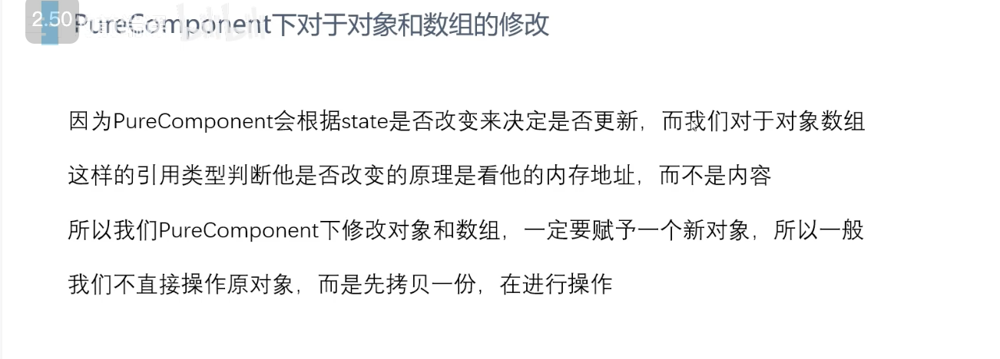
假设我们有一个包含对象的状态，我们希望更新对象的某个属性。

```jsx
import React, { Component } from 'react';

class ObjectStateExample extends Component {
  constructor(props) {
    super(props);
    this.state = {
      user: {
        name: 'John',
        age: 30
      }
    };
  }

  updateName = () => {
    this.setState((prevState) => ({
      user: {
        ...prevState.user,
        name: 'Jane'
      }
    }));
  };

  render() {
    return (
      <div>
        <p>Name: {this.state.user.name}</p>
        <p>Age: {this.state.user.age}</p>
        <button onClick={this.updateName}>Update Name</button>
      </div>
    );
  }
}

export default ObjectStateExample;
```

在这个示例中，我们使用展开运算符 `...prevState.user` 创建一个新的 `user` 对象，并更新 `name` 属性。这样可以确保 `user` 对象的引用发生变化，从而触发重新渲染。

#### 数组的 `setState` 示例

假设我们有一个包含数组的状态，我们希望更新数组中的某个元素。

```jsx
import React, { Component } from 'react';

class ArrayStateExample extends Component {
  constructor(props) {
    super(props);
    this.state = {
      items: ['Item 1', 'Item 2', 'Item 3']
    };
  }

  updateItem = (index, newItem) => {
    this.setState((prevState) => {
      const newItems = [...prevState.items];
      newItems[index] = newItem;
      return { items: newItems };
    });
  };

  render() {
    return (
      <div>
        <ul>
          {this.state.items.map((item, index) => (
            <li key={index}>{item}</li>
          ))}
        </ul>
        <button onClick={() => this.updateItem(1, 'Updated Item 2')}>Update Item 2</button>
      </div>
    );
  }
}

export default ArrayStateExample;
```

在这个示例中，我们创建了一个新的 `items` 数组，并更新了指定索引处的元素。通过创建新的数组，可以确保数组的引用发生变化，从而触发重新渲染。

### 总结

- 为了让 React 检测到状态变化并触发重新渲染，状态对象或数组的引用必须发生变化。
- 使用展开运算符 `...` 可以创建新的对象或数组，从而确保状态引用变化。
- 避免直接修改现有的对象或数组，应该创建它们的新副本进行修改。

当你没有使用展开运算符（或其他方法创建新对象或数组），而是直接修改现有对象或数组时，React 可能无法检测到状态变化，从而不会触发重新渲染。这是因为 React 通过比较状态对象的引用来判断状态是否发生了变化。如果引用没有改变，React 会认为状态没有发生变化。

以下是一个示例，展示了没有使用展开运算符直接修改对象或数组时可能出现的问题。

### 示例：没有使用展开运算符直接修改对象

```jsx
import React, { Component } from 'react';

class ObjectStateNoSpread extends Component {
  constructor(props) {
    super(props);
    this.state = {
      user: {
        name: 'John',
        age: 30
      }
    };
  }

  updateName = () => {
    // 直接修改现有对象
    this.state.user.name = 'Jane';
    // 由于直接修改了对象，React 不会检测到状态变化
    this.setState({ user: this.state.user });
  };

  render() {
    return (
      <div>
        <p>Name: {this.state.user.name}</p>
        <p>Age: {this.state.user.age}</p>
        <button onClick={this.updateName}>Update Name</button>
      </div>
    );
  }
}

export default ObjectStateNoSpread;
```

### 示例：没有使用展开运算符直接修改数组

```jsx
import React, { Component } from 'react';

class ArrayStateNoSpread extends Component {
  constructor(props) {
    super(props);
    this.state = {
      items: ['Item 1', 'Item 2', 'Item 3']
    };
  }

  updateItem = (index, newItem) => {
    // 直接修改现有数组
    this.state.items[index] = newItem;
    // 由于直接修改了数组，React 不会检测到状态变化
    this.setState({ items: this.state.items });
  };

  render() {
    return (
      <div>
        <ul>
          {this.state.items.map((item, index) => (
            <li key={index}>{item}</li>
          ))}
        </ul>
        <button onClick={() => this.updateItem(1, 'Updated Item 2')}>Update Item 2</button>
      </div>
    );
  }
}

export default ArrayStateNoSpread;
```

### 解释

- **直接修改对象**：
  在 `ObjectStateNoSpread` 组件中，`updateName` 方法直接修改了 `this.state.user` 对象的 `name` 属性，然后调用 `setState` 传递相同的对象。这种做法不会触发 React 的重新渲染，因为 `user` 对象的引用没有变化。React 认为状态没有变化，因此不会更新视图。

- **直接修改数组**：
  在 `ArrayStateNoSpread` 组件中，`updateItem` 方法直接修改了 `this.state.items` 数组的指定索引的元素，然后调用 `setState` 传递相同的数组。这种做法同样不会触发 React 的重新渲染，因为 `items` 数组的引用没有变化。React 认为状态没有变化，因此不会更新视图。

### 正确的方法

为了确保 React 能正确检测到状态变化并触发重新渲染，应该使用展开运算符或其他方法创建新对象或数组。以下是上面示例的正确版本：

#### 使用展开运算符更新对象

```jsx
updateName = () => {
  this.setState((prevState) => ({
    user: {
      ...prevState.user,
      name: 'Jane'
    }
  }));
};
```

#### 使用展开运算符更新数组

```jsx
updateItem = (index, newItem) => {
  this.setState((prevState) => {
    const newItems = [...prevState.items];
    newItems[index] = newItem;
    return { items: newItems };
  });
};
```

### 总结

- 直接修改现有对象或数组时，React 可能无法检测到状态变化，因为对象或数组的引用没有改变。
- 使用展开运算符或其他方法创建新对象或数组，以确保状态引用发生变化，从而触发 React 的重新渲染。


## PureComponent只有这个问题
你说得对，`PureComponent` 和 `Component` 在 React 的行为上确实有一些区别，尤其是在状态更新和性能优化方面。

### `PureComponent` vs. `Component`

#### `PureComponent`

`PureComponent` 是 React 提供的一种优化机制，用于避免不必要的渲染。它通过实现 `shouldComponentUpdate` 方法，并对 `props` 和 `state` 进行浅比较（shallow comparison）来决定组件是否需要重新渲染。

- **浅比较**：`PureComponent` 只会对 `props` 和 `state` 的引用进行比较，而不会深度比较对象内部的值。这意味着如果你直接修改了对象或数组的属性，而没有创建新的引用，`PureComponent` 可能会认为状态没有变化，从而不会触发重新渲染。

- **实际行为**：由于 `PureComponent` 只进行浅比较，直接修改对象或数组的内容（而不改变其引用）可能会导致组件没有更新，尽管数据已被修改。

#### `Component`

`Component` 没有内置的 `shouldComponentUpdate` 方法。默认情况下，`Component` 会在状态或属性发生变化时重新渲染。你可以自定义 `shouldComponentUpdate` 来优化性能，但默认行为是每次状态或属性变化时都会重新渲染。

- **完整渲染**：`Component` 在状态更新时总是会重新渲染，无论你是直接修改状态还是创建新的状态对象。它不会像 `PureComponent` 那样依赖于浅比较。

### 示例

#### `PureComponent` 示例

```jsx
import React, { PureComponent } from 'react';

class MyPureComponent extends PureComponent {
  constructor(props) {
    super(props);
    this.state = {
      items: ['Item 1', 'Item 2', 'Item 3']
    };
  }

  updateItem = (index, newItem) => {
    // 直接修改数组的元素
    this.state.items[index] = newItem;
    // PureComponent 不会触发重新渲染
    this.setState({ items: this.state.items });
  };

  render() {
    return (
      <div>
        <ul>
          {this.state.items.map((item, index) => (
            <li key={index}>{item}</li>
          ))}
        </ul>
        <button onClick={() => this.updateItem(1, 'Updated Item 2')}>Update Item 2</button>
      </div>
    );
  }
}

export default MyPureComponent;
```

#### `Component` 示例

```jsx
import React, { Component } from 'react';

class MyComponent extends Component {
  constructor(props) {
    super(props);
    this.state = {
      items: ['Item 1', 'Item 2', 'Item 3']
    };
  }

  updateItem = (index, newItem) => {
    // 直接修改数组的元素
    this.state.items[index] = newItem;
    // 组件会重新渲染
    this.setState({ items: this.state.items });
  };

  render() {
    return (
      <div>
        <ul>
          {this.state.items.map((item, index) => (
            <li key={index}>{item}</li>
          ))}
        </ul>
        <button onClick={() => this.updateItem(1, 'Updated Item 2')}>Update Item 2</button>
      </div>
    );
  }
}

export default MyComponent;
```

### 总结

- `PureComponent` 通过浅比较来优化渲染，因此需要确保状态或属性的引用发生变化以触发重新渲染。
- `Component` 默认情况下会在状态或属性发生变化时重新渲染，不依赖于浅比较。

因此，**只有 `PureComponent`** 可能会遇到由于直接修改状态导致渲染未更新的问题，而 **`Component`** 通常不会受到这种影响。
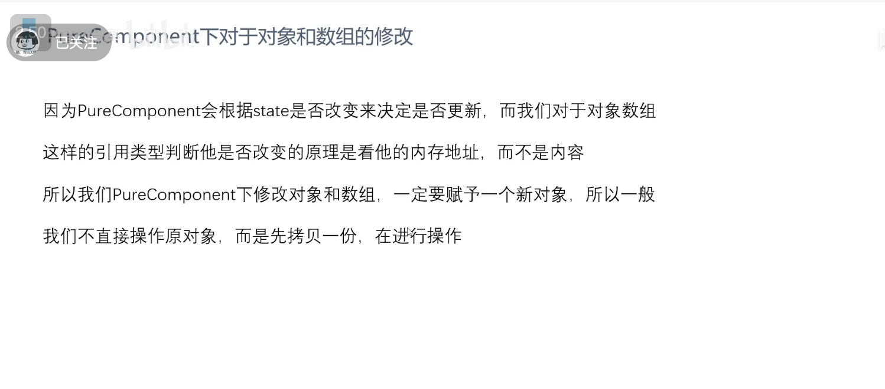
```js

import './App.css';
import React from 'react';

class App extends React.PureComponent {
  state = {
    a: 0,
    b: 1,
    c: {
      c1: 123,
      c2: 999
    },
    arr: [1, 2, 3]
  }
  addA = () => {
    // this.setState((state) => {
    //   return {
    //     a:++state.a
    //   }
    // })
    this.setState({
      a: 1,
    }, () => {
      //在这里面才能获取到更新后的值
      console.log(this.state.a)
    })

  }
  addArr() {
    //数组和对象-》判断是否改变-》内存地址判断的
    // let _arr = [...this.state.arr]
    // _arr.push(4);
    // this.setState({
    //   arr: _arr
    // }, () => {
    //   //此时内容变了，但是内存地址没变
    //   console.log(this.state.arr)
    // })
    this.state.arr.push(4);
    this.setState({
      arr: this.state.arr
    }, () => {
      //此时内容变了，但是内存地址没变
      console.log(this.state.arr)
    })
  }
  render() {
    return <div className="App">
      {this.state.a}
      <button onClick={this.addA}>加21</button>
      c数据的内容
      <div>
        {this.state.c.c1}
      </div>
      <div>
        {this.state.c.c2}
      </div>
      数组
      <div>
        {this.state.arr}
      </div>
      <button onClick={this.addArr.bind(this)}>添加数组</button>
    </div>
  }
}

export default App;
```

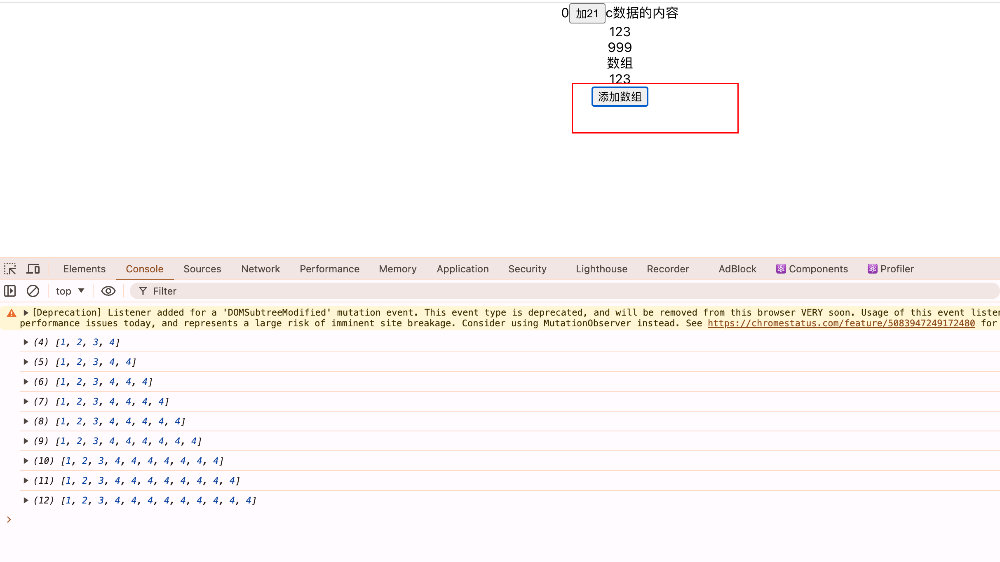

# 5. 条件渲染和列表循环

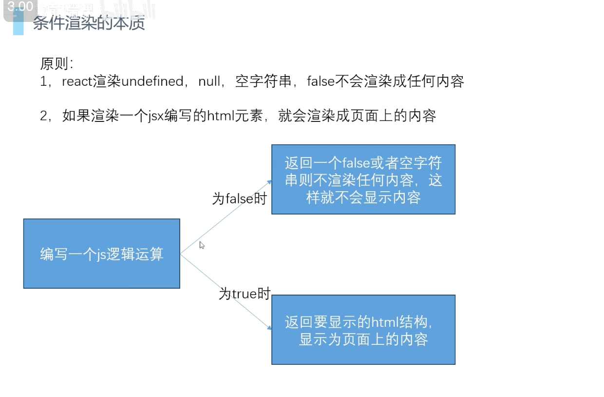

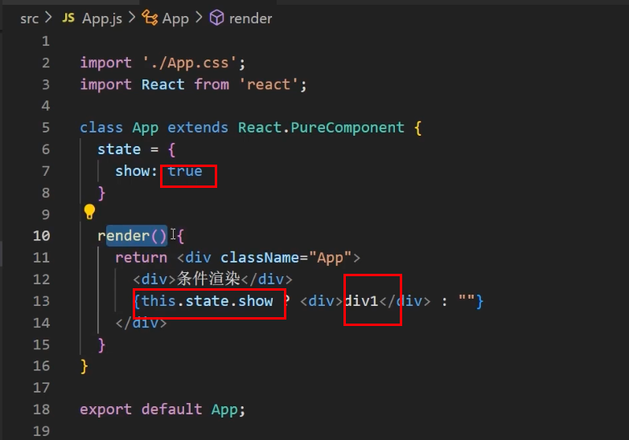

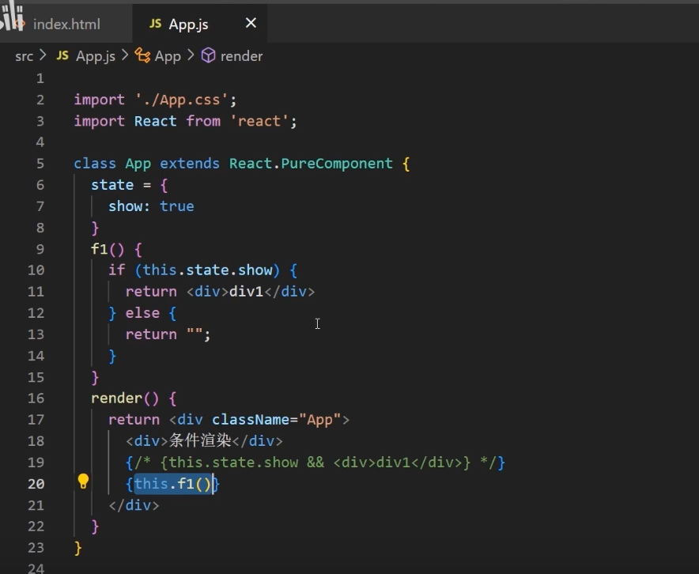


show是false则不会被渲染；
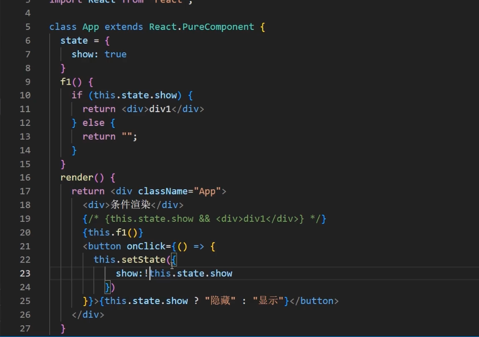

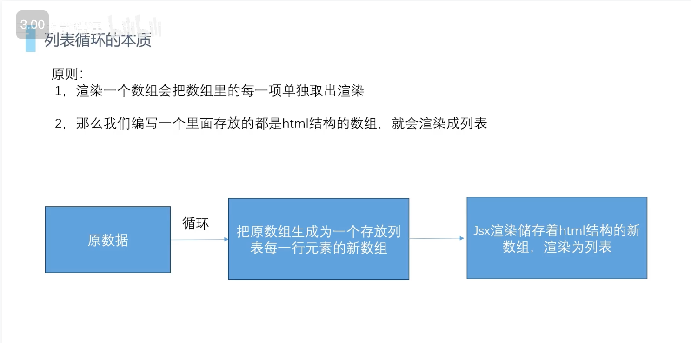

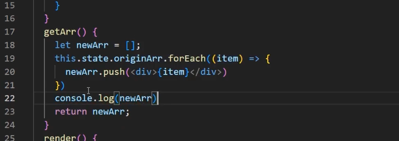
```js
import './App.css';
import React from 'react';

class App extends React.PureComponent {
  state = {
    show: true,
    originArr: [1, 2, 3]//[1,2,3]=>[<div>1</div>,<div>2</div>,<div>3</div>]
  }
  f1() {
    if (this.state.show) {
      return <div>div1</div>
    } else {
      return "";
    }
  }
  getArr() {
    //for,map-最常用，filter
    let newArr = [];
    this.state.originArr.forEach((item) => {
      newArr.push(<div>{item}</div>)
    })
    console.log(newArr);
    return newArr;
  }
  addData = () => {
    let _arr = [...this.state.originArr];
    _arr.push(Math.random() * 10);
    this.setState({
      originArr: _arr
    })
  }
  render() {
    return <div className="App">
      <div>条件渲染</div>
      {/* {this.state.show && <div>div1</div>} */}
      {this.f1()}
      <button onClick={() => {
        this.setState({
          show: !this.state.show
        })
      }}>{this.state.show ? "隐藏" : "显示"}</button>
      <div>列表渲染</div>
      {/* {this.getArr()} */}
      {
        this.state.originArr.map((item) => {
          return <div key={item}>{item}</div>
        })
      }
      <button onClick={this.addData}>添加</button>
    </div>
  }
}

export default App;

```